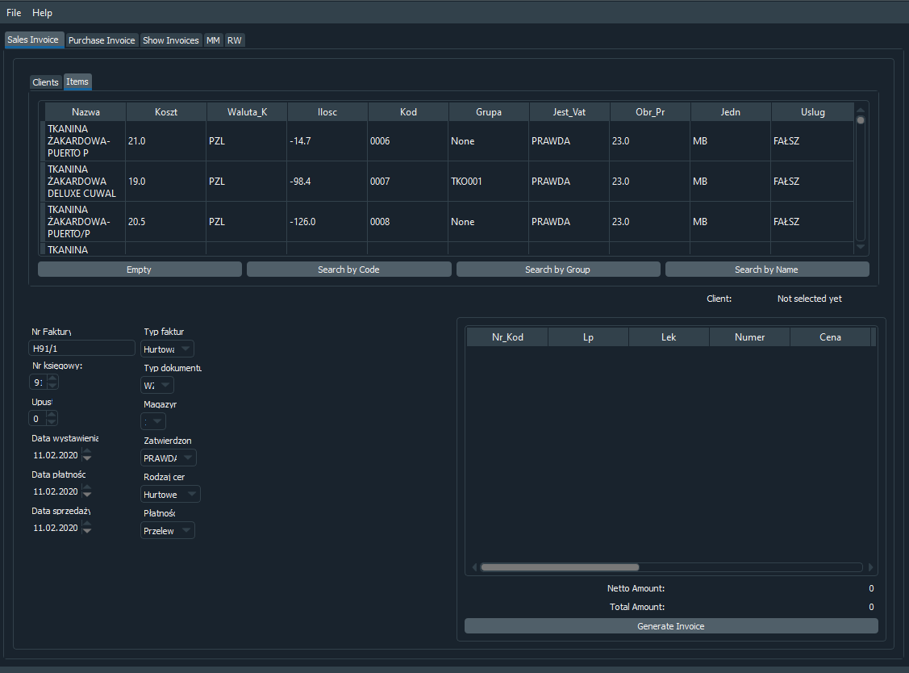

# invoiceApp
Program that allows to generate Invoice and get data from MongoDB

Now it has most of desired functionalities that allow you to generate Sale Invoice, Purchase Invoice, List Clients and many more.
It was my first real-world project so it could have some flaws and some sort of spaghetti code. 

Currently I don't have time or purpouse (It's not used anymore) to maintain it so feel free to do whatever you like with it. 

## Screenshots

